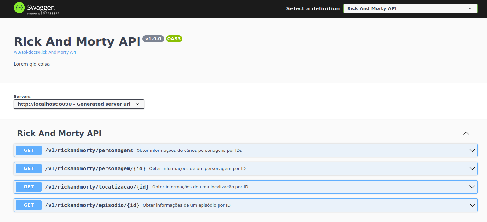

# Rick And Morty API

## Introdução

Esse projeto foi desenvolvimento para explorar os conceitos da programação reativa utilizando uma API pública do Rick And Morty.

## Getting Started

Faça uma configuração do properties setando um banco MongoDB como database, há várias formas de fazer isso.

```bash
git clone https://github.com/joaopedromachado/rickandmortyapi-webflux-reactive.git
```

## Tecnologias utilizadas
- Spring
- Java 17
- WebFlux
- MongoDB Reactive
- AssertJ
- Mockito
- Gradle
- Opendoc API (Swagger)


## Swagger


### Endpoints

#### GET /v1/rickandmorty/personagens - Obter informações de vários personagens por IDs

#### GET /v1/rickandmorty/personagem/{id} - Obter informações de um personagem por ID

#### GET /v1/rickandmorty/localizacao/{id} - Obter informações de uma localizaçao por ID

#### GET /v1/rickandmorty/episodio/{id} - Obter informações de um episódio por ID
